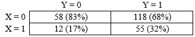

## Instructions

1.  Answer the questions below.

2.  Your final document should be an .ipynb file. You will **submit this file on canvas**, along with any other scripts you used to create the report.

3.  **Do not push any work/results to gitHub as you work on the exam**. This will result in losing many points (TBD - hopefully we don't have to cross this bridge...).

4.  In answering each question below, please include:

-   the question as a header in your jupyter Notebook
-   the raw code that you used to generate your results
-   Where relevant, the top 5 rows/values/elements of any resulting list, DataFrame or Data Series objects created in your results (unless a lesser amount is requested).

### Assignment items `[100 pts]`

1.  [`10 pts`] Web-scrape the first table in the "Sovereign states and dependencies by population" section from the following [webpage](https://en.wikipedia.org/wiki/List_of_countries_and_dependencies_by_population) and build a pd.DataFrame object. Limit your final table to two columns, "Location" and "Population". Rename "Location" to "Country" and drop the first row of data which shows global data.

    **Hint:** Although you can use *BeautifulSoup* here, there's an easier way which we covered together that I suggest you implement here.

2.  [`5 pts`] Web-scrape the first table in the "NOCs with medals" section from the following [webpage](https://olympics.fandom.com/wiki/All-time_Olympic_Games_medal_count) and build a pd.DataFrame object. Limit your final table to the first six columns focusing on summer medals only ("Team (IOC code)", "No summer", ... , "Total"). Rename the medal count columns "bronze", "silver" and "gold" as appropriate.

3.  [`5 pts`] In the DataFrame object from #2, create a new column named "Country" which cleans the "Team (IOC code)" column by removing all digits, characters, and leading or trailing white spaces.

    **Hint:** Look at the values for Australia and Barbados for two examples you need to clean.

4.  [`10 pts`] Merge the two datasets (from questions #1 and #3), performing an inner join and merging by country.

    **Note:** The country names in the two datasets don't match perfectly, so \~125 cases will remain in the data after the merge. This is ok, although in real life you would have to go through the additional step of cleaning country names to capture all the countries you have data for.

5.  [`5 pts`] Create the two categorical variables below, and once you've created them check your work by crosstabing them with the original variables (e.g., crosstabulate "population_bin" with "population").

-   "population_bin": This variable should have the value "high_population" if a country has more population than the median population across all countries, else it should have "low_population".
-   "medal_count": This variable should have four categories, bin it based on the quartiles Q1, Q2 and Q3 of the "Total" variable. Name these categories "Q1_medal_count", "Q2_medal_count", "Q3_medal_count", and "Q4_medal_count". For example, the category "Q1_medal_count" should be flagged for all countries which have **less** than Q1, while "Q2_medal_count" should flag all countries which are equal to or grater than Q1 but less than Q2.

6.  [`5 pts`] Using a pandas function, group the data by "low_population" vs "high_population" and show the mean number of medals based on the "Total" variable. In **one** **sentence**, please explain whether there is a relationship between population and medal count.

7.  `[15 pts`] Write a function that compares two categorical variables. This function should return a crosstab (i.e., contingency table) of the two variables showing the counts and **column** percentages inside each cell. This function should take in two named arguments called Y (the DV) and X (the IV), representing two different categorical variables.

    For example, if we were to cross-tabulate two generic variables X and Y which only take the values of 1 and 0, then a resulting contingency table could look like what we see below. Notice that this is a 2 x 2 table, with each cell showing the count followed by the **column percentage** in parentheses. It is conventional to put the Y variable (the DV) in the columns, and the X in the rows. Follow this practice for the function you create. Give your function a clear name. To get full points for this question, you do not need to specify default variables or execute anything (we'll call the function in the next question).

    

    **Hint:** You can use the function `pd.crosstab(index=x, columns=y)` to generate a table with counts, and you can specify an additional argument, `normalize='columns',` to get a table with column percentages.

8.  [`5 pts`] Call your function, with "medal_count" as the DV and "population_bin" as the IV. In **three sentences or less**, interpret the results. Do the results look like you would expect?

9.  [`10 pts`] Navigate to [this](https://www.geeksforgeeks.org/python-pearsons-chi-square-test/) webpage. If you scroll down, you'll see there are instructions on how to call the `chi2_contingency()` function from the `scipy` library. Follow these instructions to call this function, and report your results. In **one sentence**, please explain whether there is a significant association between "medal_count" and "Population_bin"?

    **Hint:** Leverage the following code to create the "data" object needed as input for the `chi2_contingency()` function: `data = pd.crosstab(df3['Medal_count'], df3['Population_bin'])`.

10. [`10 pts`] Navigate to [this](https://github.com/OliverSherouse/wbdata/blob/master/README.md) webpage. This is a GitHub repo named *wbdata* which acts as a tool capable of connecting to the world bank API. Follow the link listed there, to the [documentation](https://wbdata.readthedocs.io/en/stable/). Leverage the code you see on this webpage to make a call to the World Bank API, collecting data for all countries and importing two indicators: [Nominal GDP (US\$)](https://data.worldbank.org/indicator/NY.GDP.MKTP.CD?view=chart) and [Government expenditure on education (% GDP)](https://data.worldbank.org/indicator/SE.XPD.TOTL.GD.ZS?view=chart). Note that you can see the complete list of world bank indicators [here](https://data.worldbank.org/indicator).

    **Hint:** Use `pip install wbdata` to install the wbdata library.

11. [`5 pts`] What is the correlation between GDP and Government expenditure on education? (Ignore the fact that we violate the independence assumption when estimating a correlation, I\
    really just want to check that you can correlate two variables).

12. [`10 pts`] In the data folder, there are 6 datasets. Each dataset is a 100 x 11 dataset, with 8 of the variables measuring depression via 8 items (CESD_1, CESD_2, ... , CESD_8) and the other 3 indicating a unique ID, gender, and treatment status. Your task is to use the code below and finish it by writing a for loop to import the 6 datasets into a pandas DataFrame object. The final Data Frame should have dimensions of 600 x 12.

    As you write your code, you need to two things:

    -   Create a new variable called center, which starts at 1 and goes up to 6 to track the 6 different centers that we have data for

    -   make sure it is **scalable** so that it could import any number of csv files. Assume that all files would have the same 11 columns with the same variables and order.

    <!-- -->

    ```         
    import os
    import pandas as pd
    path = # Update with your path !
    os.chdir(path)
    files = os.listdir()

    # Finish for loop
    for ....
    ```

13. [`5 pts`] Create a new variable called "CESD" which is the sum of the 8 CESD items. There are three categorical factors in the dataset (gender, treatment status, and center). One of these variables correlates with CESD, the other two do not. Use any descriptive or visual technique to find which categorical factor correlates with the new CESD variable.
