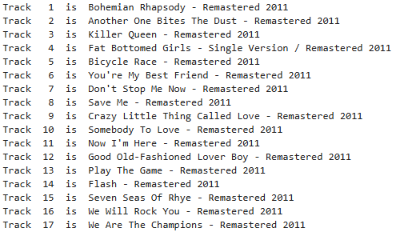

## Instructions

-   Answer the questions below
-   Your final document should be an `.ipynb` file. You will submit this file, along with any other scripts (except for the module for question 6 which might have your API authentication details) you used to create the report, on Canvas.

### Assignment items `[100 pts]`

**Part 1:** Leverage the lecture code to answer these questions.

1.  [`10 pts`] Use the BLS Data Finder 1.1 available [here](https://beta.bls.gov/dataQuery/find?st=0&r=20&more=0) to import a BLS variable/field (using the BLS web API) of your choosing.
2.  [`10 pts`] Using the BLS web API, create your own custom function which can interact with the BLS web API. Your function should take three input parameters: *name base_url_in*, *series_in*, and *title_in* and return the relevant data series as a `pd.DataFrame` object. Test your function by replicating the `GET` request you sent above for #1.
3.  [`10 pts`] Go to these three links: [link1](https://beta.bls.gov/dataViewer/view/timeseries/APU0000709112), [link2](https://beta.bls.gov/dataViewer/view/timeseries/APU000074714), [link3](https://beta.bls.gov/dataViewer/view/timeseries/APU0000708111). On these webpages, you will see three different time series data sets. For each, you will also see both a Series Title and ID. Using the function you wrote to fetch data from the BLS web API, import these data sets into Python as three separate `pd.Data.Frame` objects.
4.  [`10 pts`] Merge the data sets together into a single `pd.DataFrame` and make a time series plot showing how the CPI for these three goods has changed over the last 24 months. Each good should be shown as a unique line with different coloring/patterns and a matching legend (I suggest using the `matplotlib` library to do this).
5.  [`10 pts`] In the lecture notes, refer to the section entitled "No Python Package? Manipulate URL directly". Can you update the code in the New York Times article search API URL so that you return article data for Hillary Clinton for the time range April 1, 2024 - April 4, 2024? How many TOTAL articles were returned by this API search?

**Part 2:** Connect to other APIs

6.  [`15 pts`] In this question, we will connect to the Spotify API. Spotify has a package called `spotipy` which makes this easy. Using their [API documentation](https://spotipy.readthedocs.io/en/2.25.1/#examples), your task is to figure out how to use the album function listed on this webpage to import [Queen's Greatest Hits](https://open.spotify.com/album/6a8nlV9V8kPUbTTCJNVSsh) album. Once you have successfully used `spotipy` to pull in data for this album, write a for loop to display the following message, making sure you align the numbers as is done here:

    

**Hints:** (A) Search for "album(album_id, market=[None]{.underline})" on the API documentation page to find documentation for the album function, and (B) you'll need an authenticated Spotify account. You can use your own Spotify account details if you have your own account. Or, I made a free account which you can use to answer this problem. The details for which are below. Once you have your cid and secret setup, the third line below ("`client_credentials_manager =...")` can help you connect to and authenticate your API key.

`cid='1d79c7320efe48be8555674d48a7fd2d'`\
`secret='34a7cabc5f624302b9bb25c29d1c8057'`\
`client_credentials_manager = SpotifyClientCredentials(client_id=cid, client_secret=client_secret)`

7.  [`15 pts`] Find an API of interest to you. Sign up for an API key if necessary. Describe the API concisely and make a single call on the API and return an example of the returned data here.

**Part 3:** regex practice

8.  [`20 pts`] Import the data found in the HW5 folder. It is a single column of data that has 500 rows. This data represents a format of data that you will often encounter in research projects which use "thematic coding" for text response data. As described [here](https://www.betterevaluation.org/methods-approaches/methods/thematic-coding): "Thematic coding is a form of qualitative analysis that involves recording or identifying passages of text or images that are linked by a common theme or idea allowing you to index the text into categories and therefore establish a 'framework of thematic ideas about it' (Gibbs 2007)."

    It is ok if you are not familiar with thematic coding for qualitative/text data. Your task is to import the data and write a regex that is capable of finding the thematic code "1" whenever it appears in the string. This is more difficult than it sounds, because your regex should count all the "1"s that appear, but not "10", "11", "12", "21" etc. Also note, that sometimes "1" appears in the 2nd, 3rd... etc. position (e.g., "2, 6, 7, 1, 10"). Use this regex to add a new column to your dataset called "find_1". Display a frequency table showing the number of times your regex flagged "1" as appearing.
